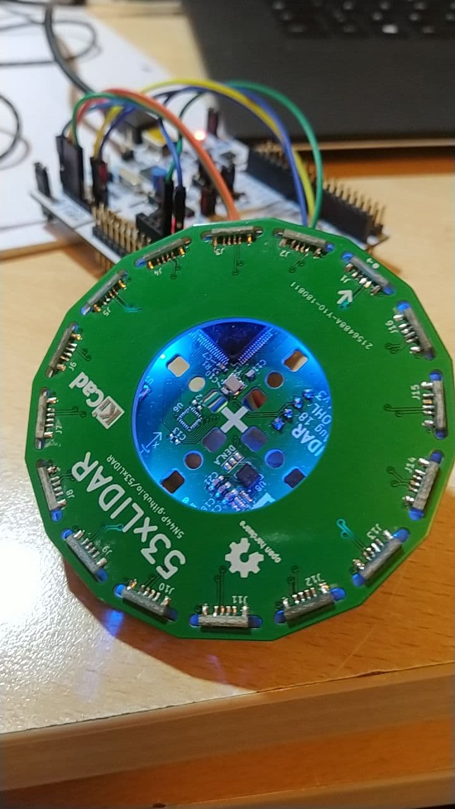

# 53xLIDAR

## Overview
Project for an opensource, all-in-one, solid state lidar.  
The lidar is made with 16 **VL53L1x** Time-of-flight IR ranging sensors.  

The sensors are operated by an **STM32F411RE** on two separate I2C buses, one for sensor 1-8, the other for 9-16. 
The XSHUTs are shared between two sensors on the two different I2C buses, while the sensors interrupts are separate for each sensor.   
For future use, there is an **LSM9DS1**, 9 DOF inertial sensor onboard.  

The lidar outputs the data via a virtual com port from the native Micro-USB, or via a 3.3V UART on a 4 pin JST-PH connector.  
Power (5V 100mA) is provided through the USB or via the 4 pin uart connector.

## Hardware
The hardware is designed in KiCAD and released under CERN OHL licence. 

It is formed by 16 sensor daughter boards, arranged in a 32 modules panel (only half panel is needed for one lidar, but for manufacturing reasons is made as a 32 modules panel); a bottom board containing all the electronics; a top board which brings the I2C line to the sensors and adds mechanical strenght and protection to the sensors.
